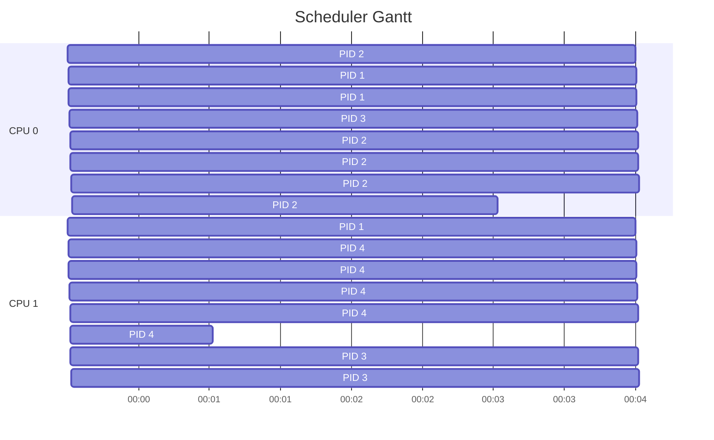
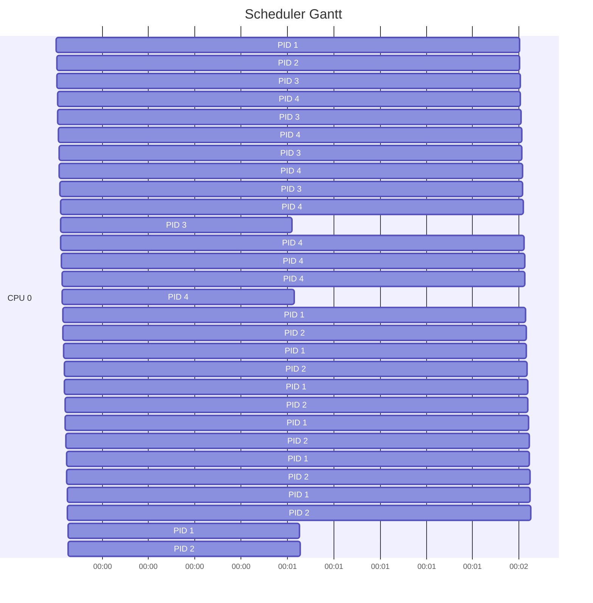
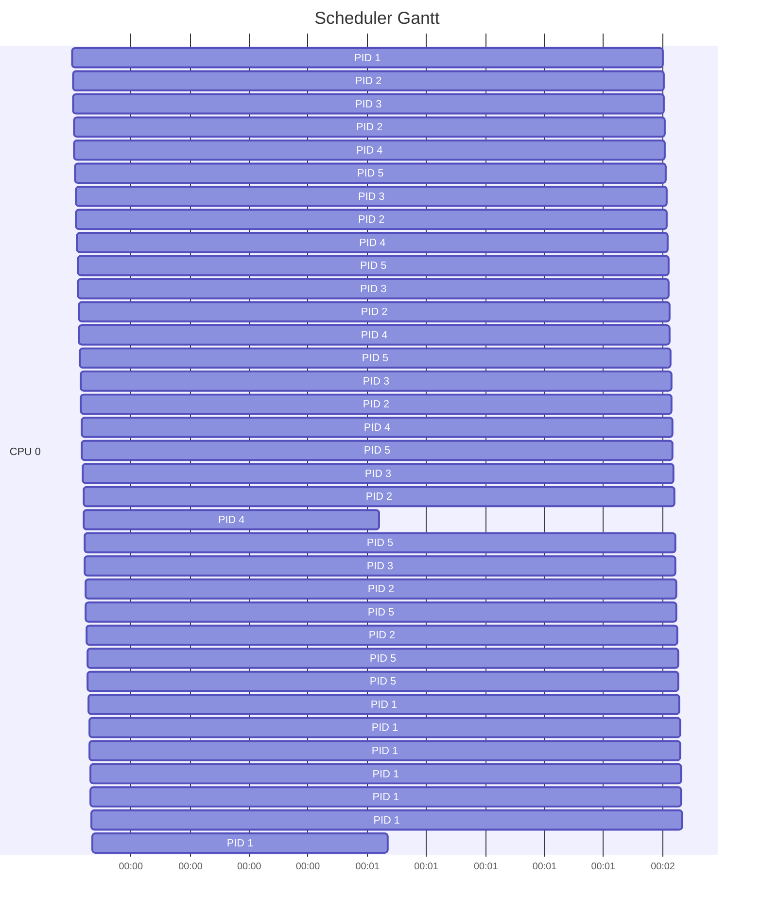
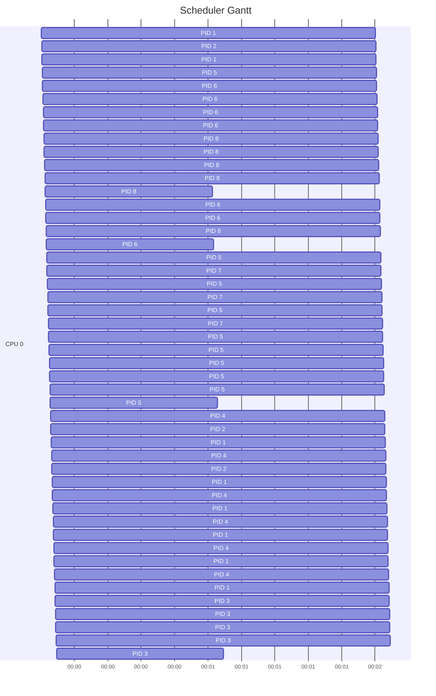

# Member 1 - Scheduler Gantt

Generated from scheduler logs. One time slot is represented by one unit.

## sched

```mermaid
gantt
  title Scheduler Gantt
  dateFormat X
  axisFormat %M:%S
  section CPU 0
  PID 2 :2,4s
  PID 1 :6,4s
  PID 1 :10,4s
  PID 3 :14,4s
  PID 2 :18,4s
  PID 2 :22,4s
  PID 2 :26,4s
  PID 2 :30,3s
  section CPU 1
  PID 1 :1,4s
  PID 4 :5,4s
  PID 4 :9,4s
  PID 4 :13,4s
  PID 4 :17,4s
  PID 4 :21,1s
  PID 3 :22,4s
  PID 3 :26,4s
```

## sched_0

```mermaid
gantt
  title Scheduler Gantt
  dateFormat X
  axisFormat %M:%S
  section CPU 0
  PID 1 :1,2s
  PID 2 :3,2s
  PID 3 :5,2s
  PID 4 :7,2s
  PID 3 :9,2s
  PID 4 :11,2s
  PID 3 :13,2s
  PID 4 :15,2s
  PID 3 :17,2s
  PID 4 :19,2s
  PID 3 :21,1s
  PID 4 :22,2s
  PID 4 :24,2s
  PID 4 :26,2s
  PID 4 :28,1s
  PID 1 :29,2s
  PID 2 :31,2s
  PID 1 :33,2s
  PID 2 :35,2s
  PID 1 :37,2s
  PID 2 :39,2s
  PID 1 :41,2s
  PID 2 :43,2s
  PID 1 :45,2s
  PID 2 :47,2s
  PID 1 :49,2s
  PID 2 :51,2s
  PID 1 :53,1s
  PID 2 :54,1s
```

## sched_1

```mermaid
gantt
  title Scheduler Gantt
  dateFormat X
  axisFormat %M:%S
  section CPU 0
  PID 1 :1,2s
  PID 2 :3,2s
  PID 3 :5,2s
  PID 2 :7,2s
  PID 4 :9,2s
  PID 5 :11,2s
  PID 3 :13,2s
  PID 2 :15,2s
  PID 4 :17,2s
  PID 5 :19,2s
  PID 3 :21,2s
  PID 2 :23,2s
  PID 4 :25,2s
  PID 5 :27,2s
  PID 3 :29,2s
  PID 2 :31,2s
  PID 4 :33,2s
  PID 5 :35,2s
  PID 3 :37,2s
  PID 2 :39,2s
  PID 4 :41,1s
  PID 5 :42,2s
  PID 3 :44,2s
  PID 2 :46,2s
  PID 5 :48,2s
  PID 2 :50,2s
  PID 5 :52,2s
  PID 5 :54,2s
  PID 1 :56,2s
  PID 1 :58,2s
  PID 1 :60,2s
  PID 1 :62,2s
  PID 1 :64,2s
  PID 1 :66,2s
  PID 1 :68,1s
```

## os_1_singleCPU_mlq_paging

```mermaid
gantt
  title Scheduler Gantt
  dateFormat X
  axisFormat %M:%S
  section CPU 0
  PID 1 :2,2s
  PID 2 :4,2s
  PID 1 :6,2s
  PID 5 :8,2s
  PID 6 :10,2s
  PID 6 :12,2s
  PID 6 :14,2s
  PID 6 :16,2s
  PID 8 :18,2s
  PID 8 :20,2s
  PID 8 :22,2s
  PID 8 :24,2s
  PID 8 :26,1s
  PID 6 :27,2s
  PID 6 :29,2s
  PID 6 :31,2s
  PID 6 :33,1s
  PID 5 :34,2s
  PID 7 :36,2s
  PID 5 :38,2s
  PID 7 :40,2s
  PID 5 :42,2s
  PID 7 :44,2s
  PID 5 :46,2s
  PID 5 :48,2s
  PID 5 :50,2s
  PID 5 :52,2s
  PID 5 :54,2s
  PID 5 :56,1s
  PID 4 :57,2s
  PID 2 :59,2s
  PID 1 :61,2s
  PID 4 :63,2s
  PID 2 :65,2s
  PID 1 :67,2s
  PID 4 :69,2s
  PID 1 :71,2s
  PID 4 :73,2s
  PID 1 :75,2s
  PID 4 :77,2s
  PID 1 :79,2s
  PID 4 :81,2s
  PID 1 :83,2s
  PID 3 :85,2s
  PID 3 :87,2s
  PID 3 :89,2s
  PID 3 :91,2s
  PID 3 :93,1s
```

